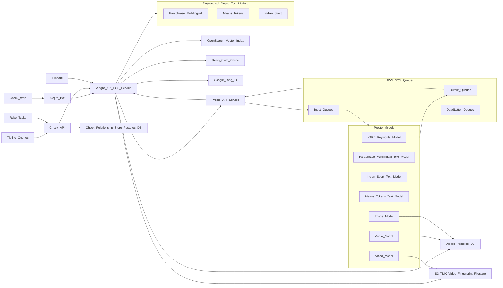

# Meedan Similarity Infrastructure Overview

This document and diagrams illustration the relationships between the parts of Meedan similarity services (Alegre) and the other Meedan systems it supports and depends on. the ‘nodes’ in this diagram  correspond to observable pieces of infrastructure. i.e. something we can go look at log files for when tracing through.

Questions:
* Does alegre bot go through Check API?

