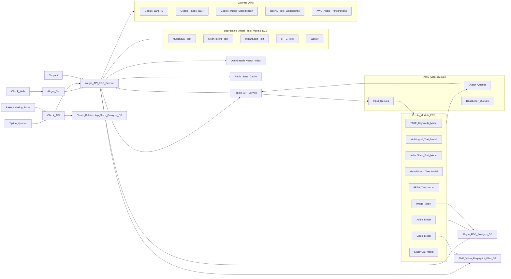

# Meedan Similarity Infrastructure Overview

This document illustrates the relationships between the parts of Meedan similarity services (Alegre) and the other Meedan systems it supports and depends on. Elements in this diagram correspond to observable pieces of infrastructure. i.e. something we can go look at log files for when tracing through.

The most common usecase is for one of the Meedan services (CheckWeb, Timpani, etc) to call the Alegre API to request storing a fingerprint for a media item and returning a list of previously stored media items with similar fingerprints.  The mechanishms for fingerprint vary considerably by media type ([see similarity-media-type-detail](similarity-media-type-detail.md) ) but in general the media is passed via SQS queues to an appropriate "Presto" model to compute a fingerprint (e.x. text embedding vector), which is stored in OpenSearch (vectors), AWS S3 filestore (video fingerprints) or a postgres database (audio fingerprints, image fingerprints)

The media items returned by a search request are used to show search results in the check web UI, establish stored relationships between content in a workspace (Check API) or to look up corresponding fact-checks to return to users (tipline queries)

Alegre relies on a number of 3rd party APIs to perform some intermediate classification (identifying language of text, etc) or extraction of text (Optical Charater Recognition, transcripts) from other media types.

Redis is used to manage state of blocking calls while wating for work to complete, and also to cache fingerprint results for quickly repeated queries.

Deprecated: Most of the text models exist both as part of Alegre and Presto, because a refactor is in process to move them out of Alegre.

Questions:
* Does alegre bot go through Check API?
* Are there other services using Alegre that are not listed?

