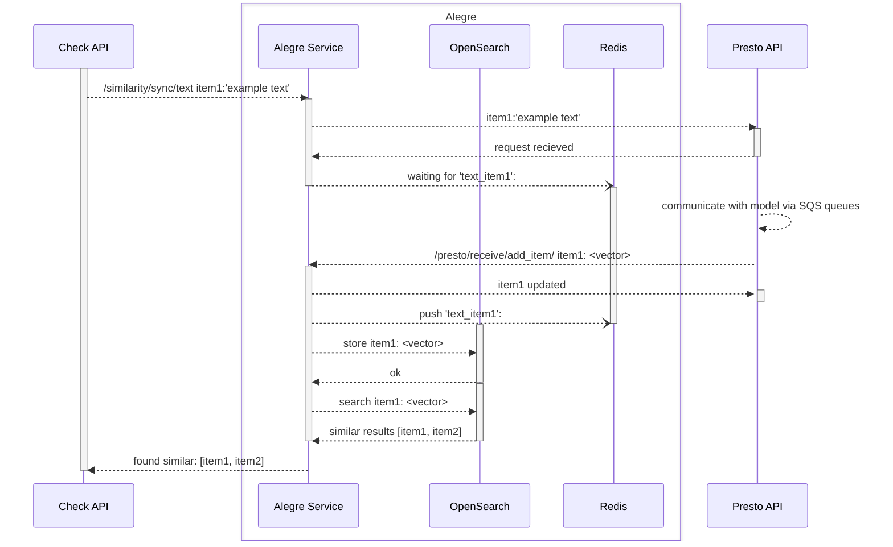

# Sequence diagram for text similarity calls

There are multiple paths

* Text similarity via old (blocking) endpoint
* Text similarity via the 'sync' (blocking) endpoint
* Text similairty via the 'async' endpoint

## /similarity/sync/text 

This diagram traces blocking  'sync' text similarity call from Check API.  When a text item is sent, the request is held open, blocking on a redis Key, until the vector response from Presto unblocks the key. The vector from the text model is then stored in the appropriate OpenSearch index seperately for each model.  Alegre then queries to look up similar items via ES text indicies and vector cosine similarity for the just-submitted item, responding to CheckAPI with any items it finds. 

Note: When there are multiple text models for various language-specific indexes, Alegre queries each one in sequence (not in parallel)

