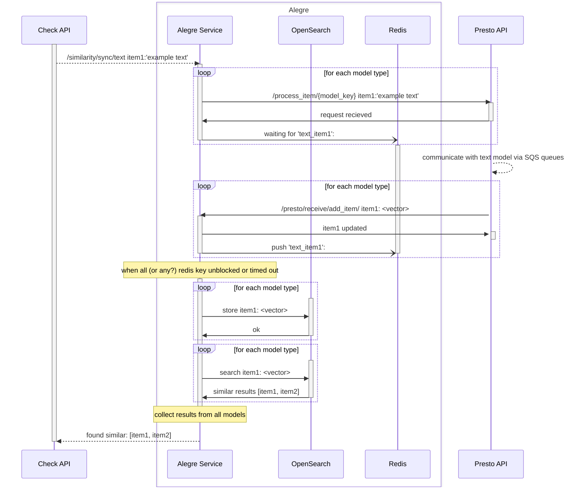
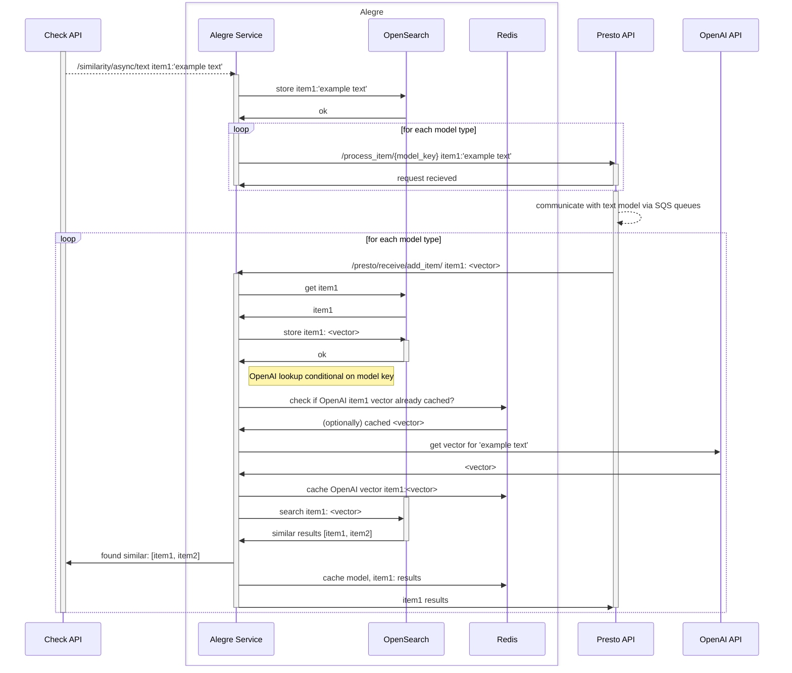

# Sequence diagram for text similarity calls [DRAFT]

There are multiple paths

* Text similarity via old (blocking) endpoint
* Text similarity via the 'sync' (blocking) endpoint
* Text similairty via the 'async' endpoint

## /similarity/sync/text 

 This diagram traces blocking  'sync' text similarity call from Check API, starting from `similarity_sync_controller.py`.  When a text item is sent, the request is held open, blocking on a redis Key, until the vector response from Presto unblocks the key. The vector from the text model is then stored in the appropriate OpenSearch index seperately for each model.  Alegre then queries to look up similar items via ES text indicies and vector cosine similarity for the just-submitted item, responding to CheckAPI with any items it finds. 

Note: When there are multiple text models for various language-specific indexes, Alegre queries each one in sequence (not in parallel)

TODO: when unpacking the presto callback loop, how do we know all keys have been recieved to respond to Check

TODO: language lookups

## /similarity/async/text 

This diagram traces the async (non-blocking) text similarity calls, starting from `similarity_sync_controller.py`.  First stores the object with out the vector?, just context (for ES text index?)  

Note: Behavior is modified by `suppress_response` (default False) and `requires_callback` (default True) arguments in call

Note: The lookup OpenAI embeddings with a redis cache is conditional on OpenAI model key, but still seems to execute after presto callback from other model?

TODO: does CheckAPI have to track state callback for each model
TODO: what is the final cache of results in redis for?

DRAFT (this needs another pass through to confirm it is correct)

